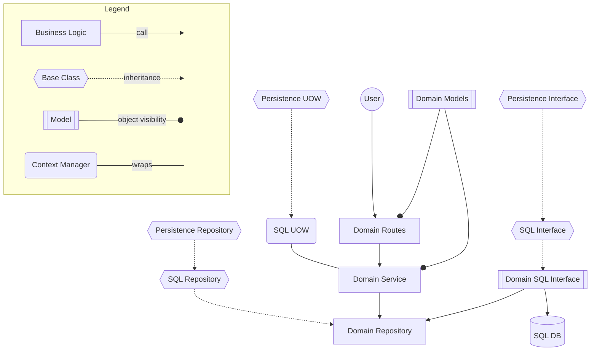

# DESTINY Repository

_Powering a comprehensive repository of climate and health research_

## Setup

### Requirements

[Poetry](https://python-poetry.org) is used for dependency management and managing virtual environments. You can install poetry either using pipx or the poetry installer script:

```sh
curl -sSL https://install.python-poetry.org | python3 -
```

### Installing Dependencies

Once Poetry is installed, install dependencies:

```sh
poetry install
```

### Configuration

A `.env` file is used to pass environment variables to the server. To avoid
accidental exposure of secrets, this file is ignored using the `.gitignore`
file. To set up a copy of the configuration (which should not require
modification to run the application), copy the example file:

```shell
cp .env.example .env
```

### Starting the development server

First you will need to start the auxiliary servers:

```sh
docker compose up -d
```

#### Database

Once the database server is running, run the migrations to setup the database.

```sh
poetry run alembic upgrade head
```

#### MinIO

You also may need the MinIO fileserver. This requires the MinIO Client. Install instructions for Mac:

```sh
brew install minio-mc
```

This can be accessed at localhost:9001 or automatically seeded using the below:

```sh
chmod +x ./.minio/seed_fileserver.sh
./.minio/seed_fileserver.sh
```

Seeding also creates a configuration file at `.minio/presigned_urls.json` which can be used to pass to the application as storage URLs.

#### Application

Run the development server:

```sh
poetry run fastapi dev
```

Run the taskiq worker:

```sh
poetry run taskiq worker app.tasks:broker --fs-discover --reload
```

Alternatively, you can run the development server and taskiq worker via docker:

```sh
docker compose --profile optional up --build
```

## Organisation

The initial project includes some folders to organise the code.

### Routers

Each set of RESTful actions should be contained in a router. These are
kept in the [app/routers](app/routers/) directory. To provide a worked example, we have provided an [example router](app/routers/example.py) until we have more than a skeleton project.

### Models

Each data class should be expressed as a Pydantic model.

These are stored in the [app/models](app/models/) directory.

### Migrations

Changes to the database structure are managed through Alembic migrations. To generate a migration, update a model (eg. add a column) and then auto generate the migration:

```sh
poetry run alembic revision --autogenerate -m "Added column to model"
```

Your migration will be added to the [`app/migrations`](app/migrations/) directory.

While automatic migrations can be useful, ensure the migration `upgrade` and `downgrade` models are as you want/expect.

If you are adding a new model, ensure you import that model into the `app/migrations/env.py` file to ensure it is auto detected.

## Authentication

In development mode, we don't enforce authentication, but once deployed to production the service will require
a token from Azure Entra to call authenticated APIs (which will initially be all APIs).

A token can be acquired by an application running in a container app or VM when it has been configured with a role-assignment to the application. In terraform that would look like this:

```terraform
# Get the existing application that we want to access from our app.
data "azuread_application" "destiny_repo" {
  display_name = "DESTINY Repository"
}

# Get the service principal for that application.
resource "azuread_service_principal" "destiny_repo" {
  client_id = azuread_application.destiny_repo.client_id
  use_existing = true
}

# Create a user assigned identity for our client app
resource "azurerm_user_assigned_identity" "my_app" {
  location            = azurerm_resource_group.example.location # Replace the example!
  name                = "my_app"
  resource_group_name = azurerm_resource_group.example.name # Replace the example!
}

# Finally create the role assignment for the client app
resource "azuread_app_role_assignment" "example" {
  app_role_id         = azuread_service_principal.destiny_repo.app_role_ids["import"]
  principal_object_id = azurerm_user_assigned_identity.my_app.principal_id
  resource_object_id  = azuread_service_principal.destiny_repo.object_id
}
```

Then within the application code of the client app you can do something like this:

```python
import msal
import requests

auth_client = msal.ManagedServiceIdentityClient(
    {"ManagedIdentityIdType": "ClientId", "Id": "<CLIENT_ID>"},
    http_client=requests.Session()
)
auth_client.acquire_token_for_client(resource="<APPLICATION URL>")
```

In the above example `<CLIENT ID>` should be the client id of the user defined identity you created with terraform, and `<APPLICATION URL>` should be the URL for the DESTINY Repo application (it should start with `api://`).

To get a token for use in a development environment, there is a utility module:

```shell
poetry run python -m app.utils.get_token
```

## Development

Before commiting any changes, please run the pre-commit hooks. This will ensure that the code is formatted correctly and minimise diffs to code changes when submitting a pull request.

Install the pre-commit hooks:

```sh
poetry run pre-commit install
```

pre-commit hooks will run automatically when you commit changes. To run them manually, use:

```sh
poetry run pre-commit run --all-files
```

See [.pre-commit-config.yaml](.pre-commit-config.yaml) for the list of pre-commit hooks and their configuration.

## Tests

Tests are in the [tests](/tests) directory. They are run using `pytest`

```sh
poetry run pytest
```

End-to-end testing is run separately in a containerised context:

```sh
docker compose down -v \
&& docker compose -f docker-compose.yml -f docker-compose.e2e.yml up -d --force-recreate --remove-orphans \
&& docker compose -f docker-compose.yml -f docker-compose.e2e.yml logs -f --tail=0 e2e repository e2e-task-worker
```

## Structure

Simplified diagram of inheritance, object visibility and data flow for a domain router:



Below is an overview of the project structure.

### Core

- **Operational Classes:** Used for aspects like authentication, configuration, and logging.

### Domain

Contains a directory for each set of related structures. Each directory includes:

- **Models**

  - **Models:** Domain models used throughout the domain.
  - **Persistence (e.g. SQL):** Models used for persisting to data stores, including translation methods to/from domain models.

- **Repository**

  - Contains interfaces between the domain and persistence implementations. It only accepts domain models as input and output, using the DTO for any persistence changes.

- **Routes**

  - Provides the FastAPI router for external interfacing and generates Units of Work (UOWs) for the service.

- **Service**
  - Performs business processing and logic.
  - Note that some functions are decorated with UoWs, and others aren't. Careful decision needs to be made to where the UoW boundary is drawn. Don't worry, if you try to call a decorated function from within a decorated function the app will tell you!

### Persistence

- **Base Classes:** For each persistence implementation to inherit.
  - **Persistence implementation (SQL):** Base classes designed for each domain module to inherit, and the interface to the data store itself (eg, a SQL session generator).
